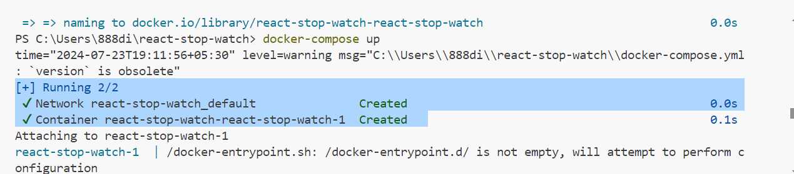
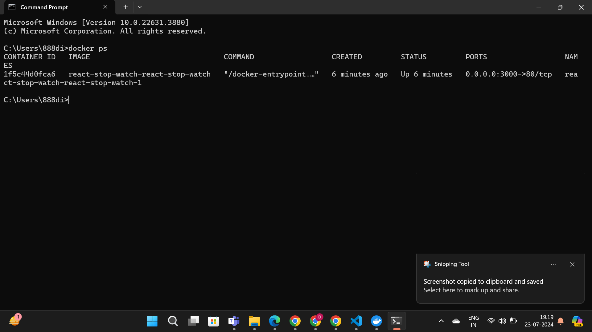
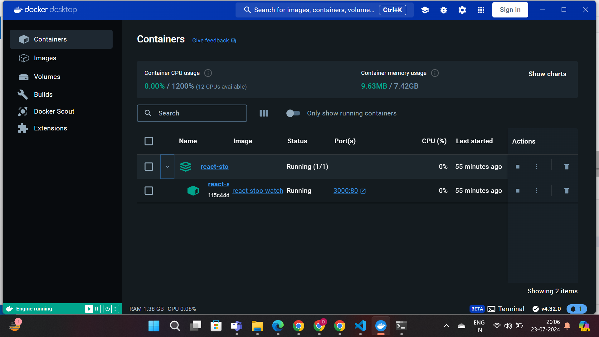

# React Stop Watch with Docker

This project is a simple React application implementing a stopwatch. Users can start, pause, resume, and reset the timer. This README file provides a comprehensive guide on how to set up and run the application using Docker, ensuring a consistent environment for development and production.

## Application Overview

### Features

- Start the stopwatch
- Pause the stopwatch
- Resume the stopwatch
- Reset the stopwatch

### Prerequisites

Ensure you have the following installed on your system before proceeding:

- [Docker](https://www.docker.com/)
- [Docker Compose](https://docs.docker.com/compose/)

## Docker Setup

This section explains how to build and run the React Stop Watch application using Docker.

### Dockerfile

The `Dockerfile` contains the necessary instructions to create a Docker image for the React application.

```Dockerfile
# Use the official Node.js image as a base
FROM node:20

# Set the working directory inside the container
WORKDIR /app

# Copy package.json and package-lock.json
COPY package*.json ./

# Install dependencies
RUN npm install

# Copy the rest of the application code
COPY . .

# Build the React application for production
RUN npm run build

# Use nginx to serve the application
FROM nginx:alpine

# Copy the build files to the nginx html directory
COPY --from=0 /app/build /usr/share/nginx/html

# Expose the port the app runs on
EXPOSE 80

# Start nginx
CMD ["nginx", "-g", "daemon off;"]

### Dockerfile
The docker-compose.yml file defines the services and configuration needed to run the Docker container.
version: '3'
services:
  react-stop-watch:
    build: .
    ports:
      - '3000:80'

## Building and Running the Docker Container

### Build the Docker image:
docker-compose build

### Run the Docker container:
docker-compose up

### Open your browser and navigate to http://localhost:3000 to access the application.

#Conclusion
This React Stop Watch application demonstrates the basics of creating a React app and containerizing it using Docker. By following the instructions in this README file, you can easily set up and run the application on your local machine or deploy it to a production environment using Docker.

#Screenshot Of Building The Docker Image


#Screenshot Of Running The Docker Container


#Screenshot Of Docker Desktop



